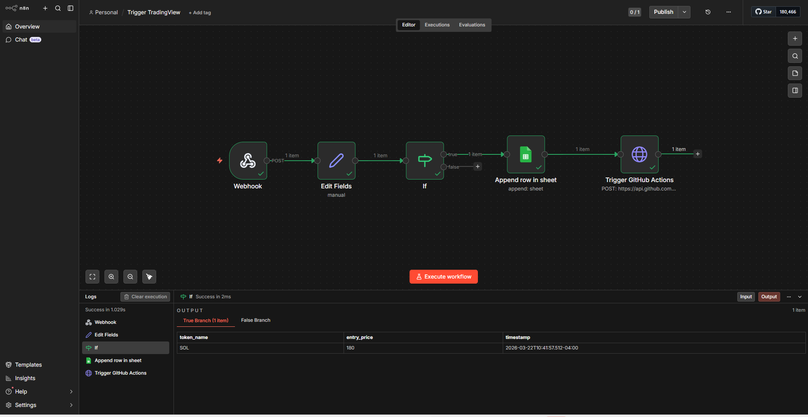

# Top-Down AI Trading Firm (LangGraph Architecture)

## Overview
This project implements an automated, Multi-Agent Artificial Intelligence trading system utilizing a strict Top-Down Analysis methodology. It leverages a state-graph architecture (LangGraph) and the Llama 3 models (via Groq API) to process market data, synthesize macrotechnicals trends, and generate highly calibrated trading decisions.

## System Architecture

graph TD
    %% Define Layers
    subgraph Trigger Layer [1. Event & Trigger Layer]
        TV[External Market Signal / TradingView] -->|JSON Payload| N8N_WH(n8n Webhook)
    end

    subgraph Automation Layer [2. n8n Automation & Audit]
        N8N_WH --> N8N_FILTER{Data Filter & Extract}
        N8N_FILTER -->|Valid Signal| GS[(Google Sheets Audit Trail)]
        N8N_FILTER -->|Valid Signal| GH_TRIG(GitHub HTTP Request)
    end

    subgraph Execution Layer [3. GitHub Actions CI/CD]
        GH_TRIG -->|repository_dispatch| GH_RUNNER[Ubuntu Runner]
        GH_RUNNER -->|Inject Env Vars| PY_MAIN(main.py)
    end

    subgraph AI Engine [4. LangGraph Multi-Agent Engine]
        PY_MAIN --> STATE((Trading State))
        
        STATE <--> TOOLS[Tools: CCXT Data & Indicators]
        STATE <--> GROQ[Groq API / Llama 3]
        
        GROQ --> H1[H1 Strategist Agent]
        H1 --> M15[M15 Analyst Agent]
        M15 --> M5[M5 Sniper Agent]
        M5 --> GUARD[Risk Guardrail]
        GUARD --> CIO[CIO Manager Agent]
        
        CIO --> DECISION{Final Decision}
    end

    subgraph Notification Layer [5. Dispatch]
        DECISION -->|Execute Trade / Standby| TELEGRAM[Telegram API]
        TELEGRAM --> USER([User / Ki's Phone])
    end

    %% Flow styling
    classDef ai fill:#f9f0ff,stroke:#d8b4e2,stroke-width:2px;
    classDef db fill:#e1f5fe,stroke:#81d4fa,stroke-width:2px;
    classDef trigger fill:#fff3e0,stroke:#ffcc80,stroke-width:2px;
    
    class GROQ,H1,M15,M5,CIO,GUARD ai;
    class GS db;
    class TV,N8N_WH trigger;

The architecture is designed to mitigate Large Language Model (LLM) hallucination by compartmentalizing analysis and enforcing strict programmatic guardrails. Rather than a linear script, the system operates as a finite state machine where a central `TradingState` is passed between specialized departments.

The pipeline consists of specific AI agents and deterministic modules:

1. **Data Fetcher (Tools)**: Acquires multi-timeframe OHLCV data from Kraken and calculates technical indicators (RSI, MACD).
2. **H1 Strategist Agent**: Analyzes the overarching macroeconomic direction and identifies market structures.
3. **M15 Analyst Agent**: Scans for localized market structures and chart patterns (SMC, Flags, Triangles) that align with the macro trend.
4. **M5 Sniper Agent**: Acts as the execution layer, identifying immediate momentum shifts via short-term candlestick formations to define exact Entry, Stop Loss, and Take Profit levels.
5. **Risk Guardrail (Deterministic)**: A pure mathematical module that intercepts the Sniper's signal. It calculates the absolute Risk-to-Reward (RR) ratio. If the ratio falls below the acceptable threshold (e.g., 1:1.5), the system automatically rejects the trade.
6. **CIO Manager Agent**: Synthesizes the reports from all underlying agents to provide a final professional reasoning for the system's decision.
7. **Telegram Dispatcher**: Asynchronously delivers the executive summary to the user's device.

## Event-Driven Automation & Audit Trail (Proof of Concept)
While the core trading engine operates on a robust chronological schedule (via GitHub Actions Cron), this repository also includes a Proof of Concept (PoC) for an **Event-Driven Webhook Architecture**. 
I designed a workflow using **n8n** to handle real-time market signals, filter data payloads, and create an immutable audit trail.
 

**Workflow Capabilities:**
1. **Webhook Trigger:** Listens for real-time external market alerts (e.g., TradingView).
2. **Data Transformation:** Parses JSON payloads to extract specific asset variables (`token_name`, `entry_price`).
3. **Logic Gate:** Filters out invalid or low-probability signals before execution.
4. **Audit Trail:** Automatically appends execution logs to a Google Sheets database for transparent historical tracking.
5. **Remote Execution:** Fires a `repository_dispatch` to GitHub Actions, instantly waking up the Python trading agents.

**Explore the Blueprint:** The complete workflow architecture is exported and available in the root directory as `n8n-trading-automation.json`.

## Prerequisites
- Python 3.9+
- CCXT (Cryptocurrency Exchange Trading Library)
- Pandas & TA (Technical Analysis)
- LangChain, LangChain-Groq, & LangGraph
- Python-dotenv

## Installation and Setup
1. Clone this repository to your local machine.
2. Create and activate a Python virtual environment.
3. Install the required dependencies:
   `pip install -r requirements.txt`
4. Create a `.env` file in the root directory. You must supply the following environment variables:
   - `GROQ_API_KEY=your_groq_api_key_here`
   - `TELEGRAM_TOKEN=your_telegram_bot_token_here`
   - `TELEGRAM_CHAT_ID=your_telegram_chat_id_here`

## Usage
To execute a single analysis cycle, run the main control panel:
```bash
python main.py
```
The system will dynamically route the decision-making process. If a macro trend is invalid, it will short-circuit the execution to save compute resources and immediately dispatch a standby notification.

## Disclaimer
This software is provided for educational, research, and analytical purposes only. It does not constitute financial advice. Do not deploy this system with real capital without conducting extensive backtesting. The creator assumes no liability for any financial losses incurred.
