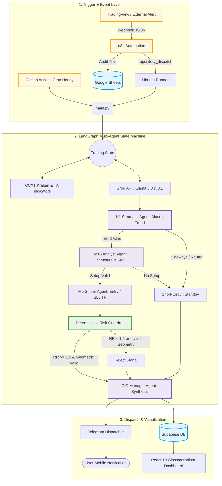

# 🚀 Top-Down AI Trading Agent (LangGraph Architecture)

[](https://www.python.org/)
[](https://github.com/langchain-ai/langgraph)
[](https://groq.com/)
[](tests/)
[](#-automated-quality--readability-audits)
[](LICENSE)

An institutional-grade, multi-agent automated crypto trading firm built on a **Top-Down Analysis** methodology. The system combines multi-timeframe LLM reasoning (Groq / Llama 3) with **mathematically deterministic risk guardrails**, enterprise resilience engineering (retries with backoff, circuit breakers, rate limiters), an automated daily AI news pipeline, and a modern real-time glassmorphism web dashboard.

---

## 🏛️ System Architecture


```mermaid
graph TD
    subgraph Trigger [1. Trigger & Event Layer]
        CRON[GitHub Actions Cron Hourly] --> PY_MAIN(main.py)
        TV[TradingView / External Alert] -->|Webhook JSON| N8N[n8n Automation]
        N8N -->|Audit Trail| GS[(Google Sheets)]
        N8N -->|repository_dispatch| GH_RUNNER[Ubuntu Runner]
        GH_RUNNER --> PY_MAIN
    end

    subgraph Engine [2. LangGraph Multi-Agent State Machine]
        PY_MAIN --> STATE((Trading State))
        
        STATE <--> TOOLS[CCXT Kraken & TA Indicators]
        STATE <--> GROQ[Groq API / Llama 3.3 & 3.1]
        
        GROQ --> H1[H1 Strategist Agent: Macro Trend]
        H1 -->|Trend Valid| M15[M15 Analyst Agent: Structure & SMC]
        H1 -->|Sideways / Neutral| STANDBY[Short-Circuit Standby]
        M15 -->|Setup Valid| M5[M5 Sniper Agent: Entry / SL / TP]
        M15 -->|No Setup| STANDBY
        M5 --> GUARD[Deterministic Risk Guardrail]
        GUARD -->|RR >= 1.5 & Geometric Valid| CIO[CIO Manager Agent: Synthesis]
        GUARD -->|RR < 1.5 or Invalid Geometry| REJECT[Reject Signal]
        REJECT --> CIO
        STANDBY --> CIO
    end

    subgraph Dispatch [3. Dispatch & Visualization]
        CIO --> TELEGRAM[Telegram Dispatcher]
        CIO --> SUPABASE[(Supabase DB)]
        SUPABASE --> DASHBOARD[React 19 Glassmorphism Dashboard]
        TELEGRAM --> USER([User Mobile Notification])
    end

    classDef ai fill:#ede7f6,stroke:#7e57c2,stroke-width:2px;
    classDef guard fill:#e8f5e9,stroke:#43a047,stroke-width:2px;
    classDef trigger fill:#fff8e1,stroke:#ffa000,stroke-width:2px;
    classDef db fill:#e1f5fe,stroke:#039be5,stroke-width:2px;

    class H1,M15,M5,CIO ai;
    class GUARD guard;
    class CRON,TV,N8N trigger;
    class GS,SUPABASE db;
```

---

## 🌟 Key Capabilities & Technical Highlights

### 1. Multi-Agent Top-Down Analysis Engine
- **H1 Macro Strategist (`Llama-3.3-70B`)**: Assesses macro trend bias (`BULLISH`, `BEARISH`, `SIDEWAYS`) and key EMA/RSI market structures. Automatically aborts on uncertain regimes to conserve compute and avoid false breakouts.
- **M15 Micro Structure Analyst (`Llama-3.3-70B`)**: Identifies Smart Money Concepts (SMC), fair value gaps (FVG), order blocks, and continuation patterns aligned strictly with the macro bias.
- **M5 Execution Sniper (`Llama-3.1-8B`)**: Pinpoints precise entry triggers, invalidation stop loss (SL), and take profit (TP) targets based on recent price action.
- **CIO Executive Manager (`Llama-3.1-8B`)**: Synthesizes multi-agent context into institutional executive reports explaining the trade rationale or rejection logic.

### 2. Deterministic Mathematical Risk Guardrails
- **Zero-Hallucination Risk Gate**: Bypasses LLMs entirely for financial safety checks.
- **Directional Geometry Validation**: Enforces strict invariants (Long: `SL < Entry < TP`; Short: `TP < Entry < SL`).
- **Minimum Risk-to-Reward Ratio**: Strictly rejects any setup with `RR < 1.5` (`MIN_RR_RATIO = 1.5`).
- **Fixed-Fractional Position Sizing**: Mathematically sizes positions using account balance (default `$10,000`), maximum risk per trade (`2%` = `$200`), and a hard safety cap of `10%` maximum portfolio allocation.

### 3. Production Resilience & Hardening (PRR Score: 90.0/100)
- **Retry with Exponential Backoff**: `@retry_with_backoff` decorator with randomized jitter for all network calls (Groq API, Kraken CCXT, Supabase, RSS feeds).
- **Circuit Breaker**: Trips dynamically after 3 consecutive exchange/LLM failures, switching to a failsafe recovery mode with timeout reset.
- **Token Bucket Rate Limiting**: Enforces strict request pacing to prevent HTTP 429 rate limit errors from exchange and AI providers.

### 4. Automated Daily AI Crypto News Pipeline
- **Scheduled Pipeline**: Runs daily at 01:00 UTC (08:00 WIB) via GitHub Actions (`.github/workflows/news_fetcher.yml`).
- **Multi-Source Aggregation**: Fetches the latest 24-hour crypto news from 5 major RSS feeds: *CoinTelegraph, CoinDesk, Decrypt, Bitcoin Magazine, The Defiant*.
- **AI Classification**: Categorizes news into `TECHNICAL`, `FUNDAMENTAL_MACRO`, and `FUNDAMENTAL_ONCHAIN` with sentiment scoring (`BULLISH`, `BEARISH`, `NEUTRAL`) and single-sentence executive summaries.
- **Supabase Integration**: Persisted directly to PostgreSQL for live frontend consumption.

### 5. Modern Glassmorphism Web Dashboard
- **Frontend Stack**: Built with React 19, Vite, and modern Vanilla CSS (dark theme, cyan/purple neon accents, glassmorphic cards, micro-animations).
- **Real-Time Data**: WebSocket subscriptions to Supabase for live signal feed and news feed updates.
- **Deep Signal Inspection**: Modal popups displaying multi-timeframe patterns, candlestick data, RR metrics, and CIO reasoning logs.

---

## 📁 Repository Structure

```text
├── agents/                     # LangGraph specialized AI agents
│   ├── macro_agent.py          # H1 Trend Strategist (Llama-3.3-70B)
│   ├── micro_agent.py          # M15 Structure Analyst (Llama-3.3-70B)
│   ├── trigger_agent.py        # M5 Candlestick Sniper (Llama-3.1-8B)
│   ├── manager_agent.py        # CIO Executive Synthesizer (Llama-3.1-8B)
│   └── news_classifier_agent.py# Crypto News Categorizer & Sentiment
├── config/                     # Enterprise settings & logger
│   ├── settings.py             # Centralized environment parameters
│   ├── logger.py               # Structured file & console logging
│   └── supabase_client.py      # Resilient Supabase client with fallback
├── dashboard/                  # React 19 + Vite Web Application
│   ├── src/pages/              # Dashboard & News Feed pages
│   ├── src/components/         # Glassmorphism UI components (SignalCard, NewsCard)
│   └── src/lib/supabase.js     # Supabase client singleton
├── docs/                       # Structured Engineering Documentation
│   ├── 01-project-documentation/ # Architecture specs & developer notes
│   ├── 02-workflows/           # Event-driven & scheduled automation guides
│   ├── 03-prompts/             # Production prompt engineering templates
│   ├── 04-audits-logs/         # Production Readiness Review (Score 90.0/100)
│   └── qa-report/              # Readability & Consistency QA Audits (11/11 Resolved)
├── guardrails/                 # Deterministic execution safety
│   └── risk_manager.py         # Position sizing, RR validation, geometry checks
├── tests/                      # 50 Automated Pytest Cases
│   ├── test_agent_parsers.py   # LLM output sanitization & regex parser tests
│   ├── test_agent_routing.py   # StateGraph conditional edge tests
│   ├── test_backtester.py      # Historical backtesting engine tests
│   ├── test_indicators.py      # Technical indicator calculation tests
│   ├── test_market_data.py     # CCXT fetching & OHLCV formatting tests
│   ├── test_resilience.py      # Retry, Circuit Breaker, & Rate Limiter tests
│   └── test_risk_manager.py    # Risk geometry & position sizing tests
├── tools/                      # Utilities & external integrations
│   ├── backtester.py           # Multi-timeframe backtesting simulator
│   ├── indicators.py           # TA indicators (RSI 14, MACD, EMAs)
│   ├── market_data.py          # CCXT Kraken multi-timeframe candle fetcher
│   ├── news_fetcher.py         # Multi-feed RSS scraper
│   ├── resilience.py           # Circuit breaker, rate limiter, exponential retry
│   ├── telegram_notifier.py    # Telegram Bot dispatch
│   └── web_notifier.py         # Supabase signal dispatch
├── main.py                     # Primary trading cycle entrypoint
├── news_pipeline.py            # Daily news fetch & classification runner
├── health_check.py             # Environment & connectivity diagnostics
├── dry_run.py                  # Offline zero-API dry run simulation
├── docker-compose.yml          # Containerized deployment manifest
└── requirements.txt            # Python dependencies
```

---

## ⚡ Quick Start & Local Development

### 1. Prerequisites
- **Python**: 3.11 or higher
- **Node.js**: v18+ (for frontend dashboard)
- **API Keys**: Groq API Key, Telegram Bot Token (optional for local dry runs)

### 2. Python Virtual Environment Setup
```bash
# Clone the repository
git clone https://github.com/subki72/top-down-ai-trading-agent.git
cd top-down-ai-trading-agent

# Create and activate virtual environment
python -m venv .venv
# On Windows:
.venv\Scripts\activate
# On Linux/macOS:
source .venv/bin/activate

# Install dependencies
pip install -r requirements.txt
```

### 3. Environment Configuration
Copy `.env.example` to `.env`:
```bash
cp .env.example .env
```
Fill in the following variables:
```env
# Required for live agent execution
GROQ_API_KEY=gsk_your_groq_api_key_here
MODEL_MACRO=llama-3.3-70b-versatile
MODEL_MICRO=llama-3.3-70b-versatile
MODEL_TRIGGER=llama-3.1-8b-instant

# Telegram Alerts (Optional in dry-run)
TELEGRAM_BOT_TOKEN=your_bot_token
TELEGRAM_CHAT_ID=your_chat_id

# Supabase (Optional in offline mode)
SUPABASE_URL=https://your-project.supabase.co
SUPABASE_KEY=your_supabase_anon_key
```

### 4. Running Verification & Simulations

Run the automated test suite (50 unit & integration tests):
```bash
pytest -v
```

Run test suite with code coverage:
```bash
pytest --cov=guardrails --cov=agents --cov=tools --cov=config
```

Run environment and connection health check:
```bash
python health_check.py
```

Run an offline end-to-end dry-run simulation (no API keys required):
```bash
python dry_run.py
```

Execute a live trading cycle:
```bash
python main.py
```

Run the daily news pipeline:
```bash
python news_pipeline.py
```

---

## 🖥️ Running the Web Dashboard

```bash
cd dashboard
npm install
npm run dev
```
Open [http://localhost:5173](http://localhost:5173) in your browser to view the real-time AI signal feed and categorized news stream.

---

## 🐳 Docker Deployment

Run the system inside isolated Docker containers:
```bash
docker-compose up --build -d
```

---

## 📊 Automated Quality & Readability Audits

This codebase adheres to institutional readability standards and continuous quality evaluation:
- **Production Readiness Score**: **90.0 / 100** (Comprehensive verification across 50 automated tests, deterministic risk guardrails, and enterprise resilience patterns).
- **Readability & Consistency Audit**: **11 / 11 Issues Resolved (100%)** (Standardized English UI labels, explicit tuple unpacking, named constants, module-level utility helpers, and wrapped multiline prompt templates).

---

## ⚠️ Disclaimer

This software is developed strictly for **educational, experimental, and research purposes**. Cryptocurrency trading carries high financial risk. Large Language Models may produce unpredictable outputs under extreme market volatility. Always perform thorough backtesting and risk management before deploying any autonomous trading software with real capital.
